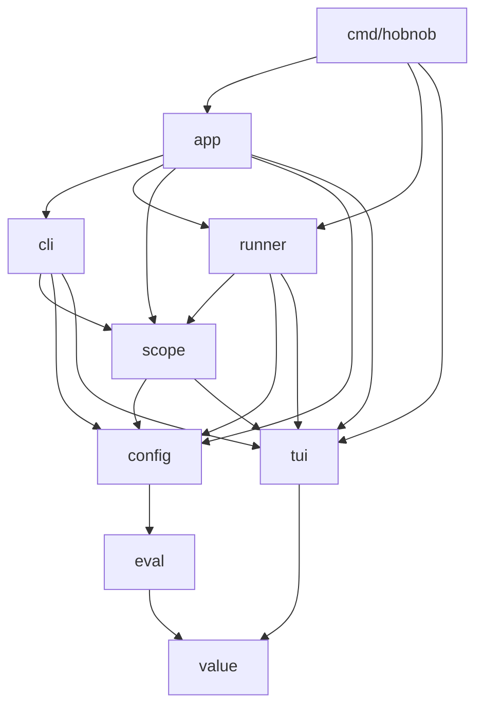
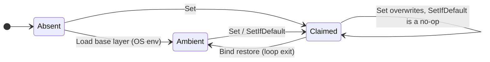
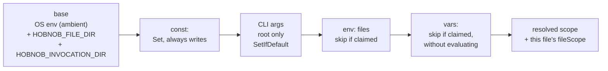
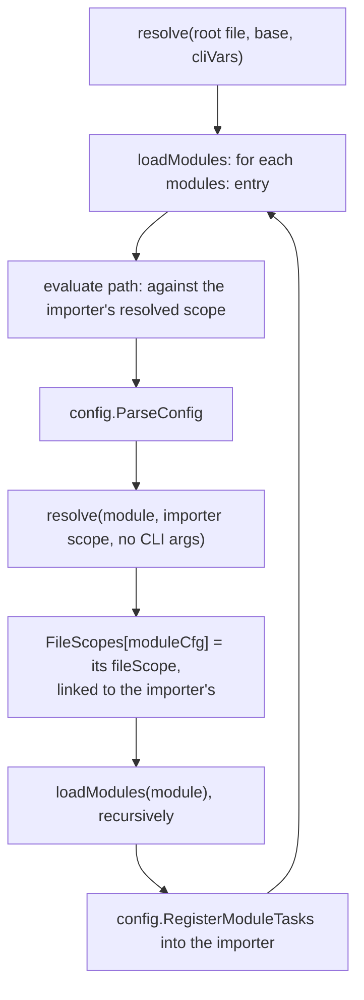
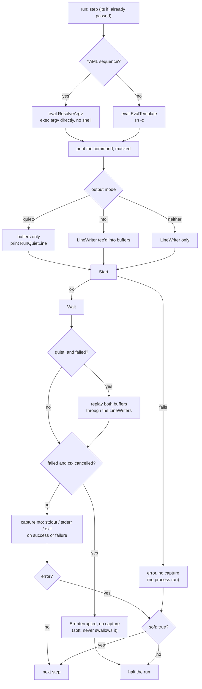
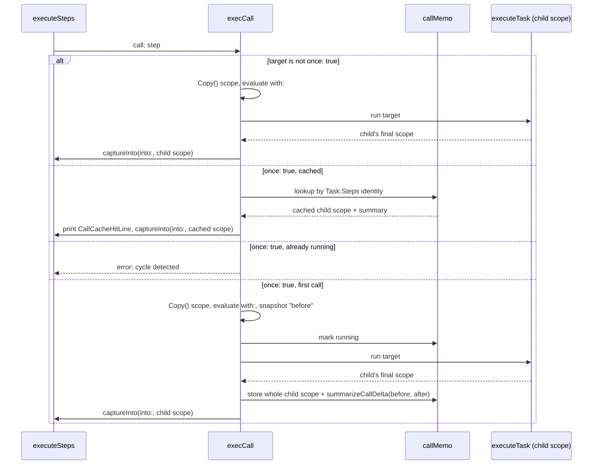
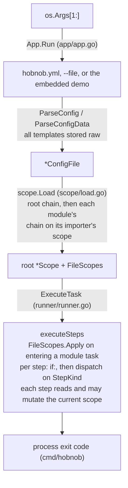

# Architecture

Hobnob is one Go binary: a YAML task runner built on a **timeline**, not a
dependency graph. A task is a list of steps. Variables, conditions and prompts
resolve in order as execution reaches each one. Two decisions shape everything:

1. **Nothing is evaluated at parse time.** Every template field is stored raw
   and rendered against the scope as it stands when execution reaches it.
2. **A variable is a typed value, not text.** nil, string, bool, number, array
   or object. JSON captured from a command stays structured for the whole run.

Domain terms (layer, precedence, upward read, file scope) are defined in
[CONTEXT.md](CONTEXT.md). Dev tasks live in `hobnob.yml` (`hobnob --list`).

## Key invariants

Every change must preserve these. Each is explained in the section named.

- **Deferred evaluation.** Templates render only at runtime, through
  `EvalTemplate`/`EvalValue`. ([config](#internalconfig-parsing))
- **Call isolation.** Every `call:` runs in a `Scope.Copy()`; only `into:`
  brings values back. The `once:` memo is keyed on `Task.Steps` identity and
  caches the whole child scope. ([runner](#internalrunner-the-interpreter))
- **Per-file load rules.** `checkConstClosedWorld`,
  `checkConstNamesNotShadowed`, `checkVarsNoSelfReference` and
  `checkEnvPathsDontReferenceVars` check each file against its own blocks.
  ([config](#internalconfig-parsing))
- **One resolution chain.** The ADR-0001 order exists only in `scope.resolve`,
  for root and modules alike. A module's file scope never leaks to its parent;
  `FileScopes.Apply` lands its `const:` with `Set` and its `env:`/`vars:` with
  `SetIfDefault`. Every `Set` claims its name. ([scope](#internalscope-the-runtime-scope-and-file-scopes))
- **Private scope maps.** Writes go through `Set`/`SetIfDefault`/`MarkSecret`/
  `Bind`; output masking reads secrets only through `Mask`/`Display`.
- **Hidden tasks.** `Task.Hidden` is true for `_`-prefixed tasks and for tasks
  from `_`-prefixed modules: they run, but stay out of `--list`.
- **Prompt seam.** Tests swap prompts with `runner.SetPrompts(text, sel)
  (restore func())`, never by reassigning `promptTextFn`/`promptSelectFn`.
- **One sniff point.** Only `value.Capture` turns text into structure. `keys`
  and accessors error on a String, naming `| json`, rather than parse it.
  ([value](#internalvalue-the-typed-scope-value))
- **Absence defers; wrong kind fails.** A missing path is a `value.Missing`
  sentinel that only `| default` catches; every other consumer raises it. A
  wrong-kind access is always an immediate error. ([value](#internalvalue-the-typed-scope-value))

## Package layout

```
cmd/hobnob/       entry point: signal handling, exit codes
internal/app/     the CLI body: flag dispatch, App.Run(ctx, args)
internal/runner/  step execution (the interpreter loop)
internal/scope/   the runtime scope, and loading the root and module file scopes
internal/cli/     --list/--help, completions
internal/tui/     bubbletea prompts, lipgloss styles, output line writers
internal/config/  YAML into typed structs, load-time rule checks
internal/eval/    template rendering, accessor rewriting, shell evaluation
internal/value/   the typed scope value, its filters and accessor engine
internal/e2e/     end-to-end CLI suite (test files only)
```

Imports run one way. An arrow means "imports":



For readability the graph omits the direct `eval`/`value` imports from
`config`, `scope`, `cli`, `runner` and `app`. See the real graph with
`go list -f '{{.ImportPath}}: {{join .Imports " "}}' ./internal/...`.

- `value` imports only the stdlib.
- `tui` imports `value` but not `eval`: `PromptText` takes a validator closure,
  so the prompt layer never learns how a shell condition works.
- `scope`, not `config`, walks modules: a module path is evaluated against its
  importer's resolved scope, and `config` cannot import `scope`. `scope`
  imports `tui` only for `SecretMask`.
- Only `internal/e2e` (all `_test.go`) imports `app`.

### `internal/value`: the typed scope value

`Value` wraps nil, `string`, `bool`, `json.Number`, `[]any` or
`map[string]any`, recursively, so `Any()` feeds the accessor engine as is.
Numbers are `json.Number`, never `float64`: no precision loss, no stray `.0`.
A seventh kind, `KindMissing`, lives only inside one accessor evaluation.

**`Capture(text)` is the one sniff point.** Text becomes structure only if it
decodes cleanly as a JSON array or object. Its only caller is `run: into:`.
Env vars, CLI args, env-file values and prompt answers go through `Str`,
unsniffed. The `json` filter is the explicit way in.

**`Filters` is the one filter registry**, serving text/template (as a
`FuncMap`, adapted in `eval`), the type-preserving evaluator, and `into:`
pipes.

**`Path` (`path.go`) evaluates an accessor chain** like
`.A.b[0][.KEY][1:3][*]`, dispatching on the container's kind, not the key's
shape. After a star or slice, later steps map over the nodes and drop
non-matches. Results come back as `PathCall`/`StarCall`/`SliceCall`.

**Absence defers; wrong kind fails.** A missing key or out-of-range index
yields `Missing`, so a later `| default` in the same pipeline can catch it.
Every other consumer raises it first: the `adaptFilter`/`evalFilterCommand`
guard, `equalValues`/`orderValues`, `EvalValue`'s final check, and
`EvalTemplate`'s marker scan (`ScanMissing`, needed because `Value.String()`
is an `fmt.Stringer` and cannot return an error). Indexing a string or slicing
an object errors immediately, and `default` never catches it.

`ShellQuote` (behind `quote` and `eval.SourceShellFile`) lives here because
`eval` imports `value`, not the reverse.

### `internal/eval`: templates, accessors, shell

Everything renders through `text/template` against `map[string]value.Value`.

- **`EvalTemplate(tmpl, vars)`** renders to a string. `templateFuncs` is built
  once at init because this is the hottest path. It overrides
  `eq`/`ne`/`lt`/`le`/`gt`/`ge`, since the builtins compare on `reflect.Kind`,
  which for a `Value` is always `Struct`.
- **`EvalValue(expr, vars)`** preserves type. When `expr` is one action on one
  var, through optional accessor and filter chains, it evaluates the parse tree
  directly against `value.Filters`/`value.Path`. Anything else falls back to
  `EvalTemplate` and returns a String. This is why `options: .TYPES` and
  `- run: [curl, .CURL_OPTS]` keep their types.
- **`EvalCondition(ctx, expr, vars, dir)`** renders, then runs `sh -c`; exit 0
  is true. Backs `if:` and `check:`. Cancellation kills the shell, so CTRL+C
  never hangs on a condition. `EvalCheckWithOverride` tests a candidate answer
  without committing it to scope.
- **`EvalIntoLeaf(leaf, source, vars)`** (`into.go`) is the one `into:` leaf
  grammar for `run:` and `call:`. A `{{ }}` leaf is a template over the
  caller's scope. Otherwise the head name (leading `.` optional) resolves
  through an `IntoSource` (`stdout`/`stderr`/`exit`, or the child's vars), and
  the rest of the leaf (`NAME|trim` works unspaced) runs through `EvalValue`'s
  typed evaluator, with the caller's vars underneath for dynamic keys. A head
  the source lacks is `Missing`. Capture happens at the source, not the chain's
  end, so a string leaf that looks like JSON stays a string.
- **`ResolveArgv(tmpls, vars)`** builds `run:`'s list form. An array splices
  into one argument per item (empty splices to nothing), an object errors
  naming the accessor fix, and an empty element stays one empty argument so
  later positions never shift.
- **`ReferencedVars(expr)`** (`refs.go`) collects every top-level var a
  template touches, dynamic keys included. The `const:`/`vars:` checks use it.
- Shared helpers: `ResolvePath` (relative to the taskfile dir), `SplitKV` (the
  `KEY=VALUE` rule for CLI args, `os.Environ()` and env files), `CloneMap`,
  `ResolveItems`/`ItemsFromValue` (`loop:`, `options:`), `IsBareRef`.

**The accessor rewriter (`accessor.go`) is the one piece of real machinery.**
text/template has no bracket subscripts, and hobnob does not fork it. Before
every parse, `rewriteAccessors` lexes each `{{ }}` action and rewrites accessor
chains into calls to `hbpath`/`hbstar`/`hbslice`. Text outside actions and
inside string, rune and raw literals passes through untouched, so a quoted
`}}` or `[` is never syntax.

Those funcs are registered twice: `chainvalue.go`'s typed evaluator calls
`value.PathCall`/`StarCall`/`SliceCall` directly, and the `FuncMap` holds
reflection wrappers for shapes it does not recognize (a bare `{{ .A.b }}`, an
accessor as an `eq` argument).

`SourceShellFile` (`shell.go`) sources a `.sh` env file in a subshell and diffs
against a baseline `env`, so noise like `SHLVL` stays out.

### `internal/config`: parsing

`ParseConfig(path)` reads a file; `ParseConfigData(data, filePath, dir)` parses
bytes, which is how the embedded `--demo` loads. Both walk a `yaml.Node` into
a `ConfigFile`. An unknown top-level key is a load error, so `taks:` fails.

Every template field is stored raw. `const:`/`vars:` are no exception: their
values still defer to `scope.Load`; only their reference structure is
inspected here.

**Load-time rules** (`constvars.go`) run per file after the whole tree is
parsed, so a module is checked against its own blocks:

- `checkConstClosedWorld`: a `const:` entry references only earlier `const:`
  entries and the two built-ins. Otherwise a constant could read a lower layer
  and still call itself fixed.
- `checkConstNamesNotShadowed`: no `set:`/`get:`/`into:`/`loop:` target may be
  a `const:` name.
- `checkVarsNoSelfReference`: a `vars:` entry may not reference its own key;
  it already is the fallback.
- `checkEnvPathsDontReferenceVars`: an `env:` path may not reference a `vars:`
  name. `vars:` reads `env:` files
  ([ADR-0001](docs/adr/0001-upward-reads-between-scope-layers.md)), so this
  would be a cycle; rejecting it at load beats a runtime "path not found".

`use:` and `rerun:` are parse errors naming `call:`/`once:` as the replacement.

**Literal assembly.** A `set:`/`with:`/`into:`/`const:`/`vars:` map or list
literal parses into a `JSONNode` tree of raw string leaves. `EvalJSONNode`
evaluates each leaf with the caller's `evalLeaf` and assembles a real Go tree,
never round-tripping through JSON text, so a leaf holding a quote or backslash
cannot corrupt the structure. `EvalSetEntry` wraps scalar-or-literal for
`set:`, `with:`, `const:` and `vars:`.

**Modules.** `modules.go` parses an entry into a `ModuleEntry` (raw path,
`show:`/`hide:`/`flatten:`). `RegisterModuleTasks` applies those filters and
registers the tasks into the importer under namespaced names. Walking imports
and reading `env:` files belong to `scope`.

`normalizeTmpl` (`yaml.go`) lets a field that is one bare reference drop its
braces: `options: .VAR[0].name` is wrapped in `{{ }}` when `eval.IsBareRef`
matches.

### `internal/scope`: the runtime scope and file scopes

`Scope` keeps four private maps, so no write skips the bookkeeping:

| Map       | Holds                                                                   |
| --------- | ----------------------------------------------------------------------- |
| `vars`    | the values, read through `Vars()` (live map, read-only by convention)   |
| `secrets` | names flagged secret, read through `IsSecret`                           |
| `ambient` | names whose value still comes only from the OS env base layer           |
| `carried` | secret values `Adopt` brought up from a `call:` child, without a name   |

Writes go through four methods:

- `Set` overwrites, propagates the secret flag, and clears `ambient`.
- `SetIfDefault` fills only an unclaimed name.
- `MarkSecret` flags a name already in scope (a `get: secret:` on a set var).
- `Bind(key, val) (restore func())` sets a `loop:` iterator; `restore` puts
  back the prior value and flags, or removes the key.

**The claimed rule.** A name is _claimed_ when present and not ambient. Only
`Load`'s base layer marks ambient; every `Set` clears it. That one rule decides
every default-tier write:



**Masking.** `Mask(text)` redacts each secret's raw and JSON-escaped forms,
named and `carried` alike, skipping bools and numbers under 4 characters as
too generic. `Display(key)` renders one value or the mask. Secrecy follows
origin, not use: `secrets` rides along on `Copy()` and masking matches values,
so a secret passed to a child under a new `with:` name stays masked. That is
why `secret:` on `with:` is a parse error: redundant at best, over-masking a
composed value like `postgres://{{.USER}}:{{.PASS}}@db` at worst. `Adopt`
covers the way back up (see `into:` under the runner).

`Copy()` deep-copies all four maps: every `call:` gets an isolated sandbox.

**`Load(ctx, cfg, cliVars, invocationDir)`** returns the root `*Scope` and
`FileScopes`. The private `resolve` holds the one copy of the
[ADR-0001](docs/adr/0001-upward-reads-between-scope-layers.md) order, shared by
root and modules. It runs in reverse precedence, so each layer reads the final
values of those above it:



Precedence (`env < vars: < env files < CLI args < const:`) falls out of this
order plus the claimed rule. `const:`/`vars:` go through
`config.EvalSetEntry` and stay typed; every other source is `value.Str`,
unsniffed.

**Modules** are walked after the root chain, depth first:



A module's chain reads its importer's resolved scope, never a caller's `with:`
or `set:`, so a module `env:` file loses to anything the importer claimed.
What the module file wrote is its **file scope**, keyed in `FileScopes` by the
module's `*ConfigFile` (its tasks' `Task.Cfg`). When a module task starts,
`FileScopes.Apply(scope, cfg)` replays the chain outermost first: `env:`/`vars:`
through `SetIfDefault`, `const:` through `Set` (nearest declaration wins).
Re-applying on a nested call is idempotent.

### `internal/cli`: presentation

`--list`/`--help` rendering, task-selector data, docs URLs pinned to the
running version, and the bash/zsh/fish completions embedded from
`internal/cli/completions/`.

### `internal/runner`: the interpreter

The core loop is `ExecuteTask` → `executeTask` → `executeSteps`:

1. `executeTask` resolves the task, calls `FileScopes.Apply` when `Task.Cfg !=
   nil` (a module task), resolves `dir:` (call-step > task > inherited), and
   checks the task's `if:`. A false `if:` prints a skip line and succeeds.
2. `executeSteps` checks each step's `if:`, dispatches on `StepKind`, and
   renders against the _current_ scope, which earlier steps may have mutated.
3. `soft:` on `run:` or `call:` makes `executeSteps` swallow any error except
   `ErrInterrupted`.

`execCtx` bundles what threads through the call graph: context, config,
`FileScopes`, task name, prompt flag, working dir, `once:` memo.
`*scope.Scope` stays a separate argument because it is what mutates: `call:`
swaps in a child scope while `execCtx` carries forward.

**`run:` (`run.go`)** branches on `Step.Argv` versus `Step.Command`; both then
share process-group setup, output plumbing, `into:` capture and interrupts:



Capture runs whatever the exit code, so a `soft: true` step still captures a
failure. `exitCodeOf` reports `-1` for a signal kill. `envWithScopeOverrides`
strips inherited env vars that scope redefines before appending scope's,
because `os/exec` takes the first occurrence and scope must win.

**`into:` (`capture.go`).** `captureInto` is the one assignment path for both
step kinds; only the source differs. `runSource` builds `stdout`/`stderr` via
`value.Capture` only when a leaf names them, and `exit` as `value.Num`; any
other name errors. `callSource` reads the child's final vars; an unset name is
`Missing`. For `call:`, every result is `Adopt`ed, and the target name is
flagged secret whenever its value carries a child secret, whatever the leaf's
shape. The name flag matters because `Display`, used by the `once:` cache-hit
line, reads only it.

**`call:` (`call.go`)** copies scope, evaluates `with:` into the child, runs
the target, then pulls results back through `into:`. A `once: true` target is
memoized per invocation in a `callMemo` on `execCtx`, which survives the scope
swap, so a shared prologue replays into sibling sandboxes:



The memo is load-bearing in three ways:

1. **Keyed on `Task.Steps` identity, not name.** `RegisterModuleTasks` can
   register one task under several names (module prefix, `flatten:` alias,
   bare name inside its module) sharing one backing array; all collapse to one
   entry.
2. **It caches the whole child scope, not a delta.** Each call site's `into:`
   projects what it wants, which a delta would have to guess in advance.
3. **A hit is announced.** `tui.CallCacheHitLine` names what the first run
   produced (`summarizeCallDelta`, masked, sorted).

A failed first run is not stored, so under `soft: true` the next call retries.

**`get:` (`get.go`)** no-ops when the var is in scope, which is how a CLI
`KEY=VALUE` satisfies a prompt. Otherwise it uses `default:`, aborts, or
prompts through `promptTextFn`/`promptSelectFn`.

**`loop:` (`loop.go`).** `execFor` dispatches on `value.Kind()`: an Object sets
`KEY`/`VALUE`, anything else sets `ITEM`, a matrix recurses over the cartesian
product. Iterators stay typed and go through `Scope.Bind`, restoring prior
values on exit.

**`set:` (`set.go`)** evaluates entries top to bottom, each seeing the last.

**Signals.** `runner_unix.go`/`runner_windows.go` manage process groups. The
first CTRL+C signals the whole group, catching children a single-PID signal
would miss, and waits. The second force-kills via `KillRunningStep`. A mutex
guards the running PID so a racing second CTRL+C never hits a reused PID.

### `internal/tui`

`linewriter.go` (the prefixing writer for `run:` output),
`prompt_text.go`/`prompt_select.go`/`prompt_taskselect.go` (bubbletea
models), and `styles.go` (lipgloss styles, the line builders like `SkipLine`
and `CallCacheHitLine`, and `SecretMask`). The runner calls `PromptText` and
`PromptSelect`; `app` injects `PromptTaskSelect` as the picker.

### `internal/app`: the CLI body

```go
type App struct {
    Version    string
    IsTerminal func() bool
    SelectTask func(ctx context.Context, tasks []tui.TaskItem) (string, error)
}
```

`IsTerminal` and `SelectTask` are fields, not package vars, so `internal/e2e`
can fake the terminal and picker per test without global state. `App.Run`
never reads `os.Args` or calls `os.Exit`, so the e2e suite runs in process.

`Run`, in order:

1. Extract `--file <path>` and `--demo`; both together is an error.
2. Answer `--version`, `--upgrade` and `completion <shell>` before looking for
   a taskfile, so they work anywhere. Reject a `_`-prefixed task name.
3. Pick a source: the embedded demo (`demo.go`, `//go:embed demo.yml`, parsed
   as though it sat in the invocation dir), `--file`, or `findTaskfile`
   walking up for `hobnob.yml` then `hobnob.yaml`.
4. `loadConfig` parses, then `scope.Load` builds the root scope and file
   scopes.
5. Route `--list`/`--help`/`--select` through `runListingFlag`, so real and
   demo paths cannot drift, or run the task via `execTask`.

With no task and no `default` task, `selectAndRun` opens the picker, or prints
the task list when there is no terminal, `CI` is set, or `--no-input` was
passed. `defaultNoPrompts` is the one place that decides this.

`upgrade.go` replaces the binary from the latest release tarball.

### `cmd/hobnob`

Thin: `app.New(version)`, SIGINT/SIGTERM handling (cancel on the first,
`runner.KillRunningStep` on the second), `Run`, error to exit code.

## Data flow, end to end



## Testing conventions

The suite is **end-to-end first**. Write a `hobnob.yml` fixture, run it through
`internal/e2e`'s harness (`e2e.Yml`/`e2e.Run`, a real `app.New(...).Run` in
process), and assert on what the user sees: output, exit code, prompts fired.
Matchers live on `e2e.Result` (`.OK`, `.Fails`, `.Out`, `.Lines`, `.Masked`,
`.Prompted`, ...), one test file per feature.

- **Never parallel.** The harness swaps `os.Stdout`, the environment and the
  working directory, all process-global.
- **Real prompts.** Drive interactive paths through `runner.SetPrompts`, not
  `--no-input`, so `get:`'s prompt mechanics stay covered.

The **mutation checklist** atop `internal/e2e/harness_test.go` lists
one-statement breaks some test must catch. Walk it after changing the harness,
in full before a release, and update it when a refactor moves what a line
names.

Write a package-local, table-driven unit test only for what e2e cannot observe:

- signals and process groups (`cmd/hobnob/main_signal_test.go`, `runner`'s
  kill and cancellation tests)
- `--upgrade` networking and tarballs (`internal/app/upgrade_test.go`)
- bubbletea `Update`/`View` (`internal/tui`)
- combinatorial pure functions: `internal/value/path_test.go`,
  `internal/eval/accessor_test.go`, `internal/eval/shell_test.go`

Production code exposes exactly three test seams: `runner.SetPrompts`,
`App.IsTerminal` and `App.SelectTask`.
